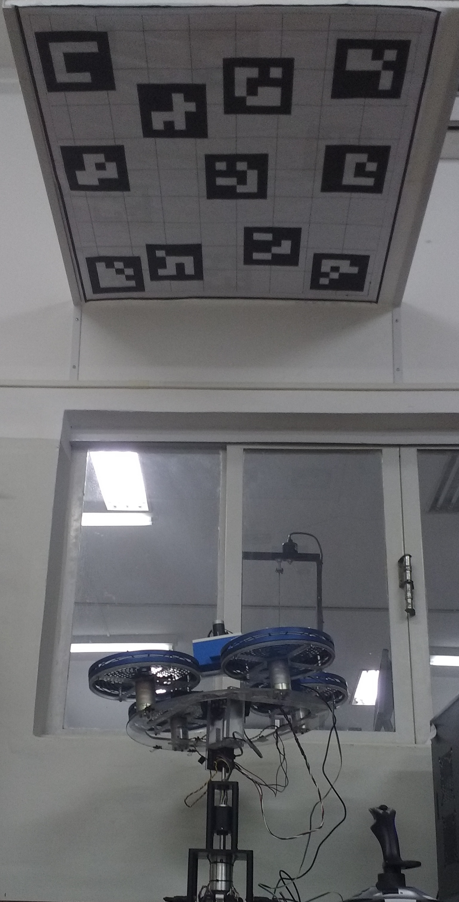
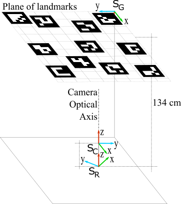

# Quanser 3D DOF for Attitude Estimation Comparison

This project consist of the software modules for the evaluation of visual-inertial algorithms for attitude estimation, using the [Quanser 3D DOF hover](https://www.quanser.com/products/3-dof-hover/) [1] as a test bed. This project is part of the work: [Comparative Evaluation of Filtering Methods in an Experimental Visual-Inertial Attitude Determination Setup](https://www.researchgate.net/publication/321505855_Comparative_Evaluation_of_Filtering_Methods_in_an_Experimental_Visual-Inertial_Attitude_Determination_Setup) [2]. 

*Disclaimer*: If you use part of this work, cite this repository and the original work. Cite as:

```
@inproceedings{inproceedings,
author = {Asfora, Beatriz and Alves de Moura, Eder and Santos, Davi},
year = {2017},
month = {01},
pages = {},
title = {Comparative Evaluation of Filtering Methods in an Experimental Visual-Inertial Attitude Determination Setup},
doi = {10.20906/CPS/CILAMCE2017-0695}
}
```

# Experimental Setup

The experimental setup is shown in Figure 1. 

<div style="width:100%; align:center;">
  <div style="float: left; margin: 25px">
    
  </div>
  <div style="float: left; margin: 25px">
    
  </div>
  <div>
  <p> Figure 1 - Experimental setup. (a) Image of the experiment. (b) Schematic view. </p>
  </div>
</div>

The hardware consist of: 

- the Quanser 3D DOF hover;
- a Inertial Measurement Unity (IMU), composed by a 3-axis acceleremoter and rate-gyro as hardware platform;
- a RGB monocular camera. 

The Quanser 3 DOF Hover is a testbed that simulates the flight dynamics and control of vertical lift-off vehicles and can be operated with Matlab and Simulink. It is characterized by:

1. Three degrees of freedom (3 DOF) – body rotates about pitch and yaw axes;
2. Precise, stiff and heavy-duty machined components;
3. Propellers driven by high-quality Pittman DC motors;
4. High-resolution optical encoders for precise position measurements; 
5. Slip ring allows infinite motion about the yaw axis. 

The high-resolution optical encoders [1] allows the evaluation of attitude estimation algorithms, by comparing the estimation with the encoders, a detailed explanation is provied in [2].


# References

1. Quanser. 3 DOF Hover. Available at: https://www.quanser.com/products/3-dof-hover/
2. ASFORA, MOURA, SANTOS. Comparative Evaluation of Filtering Methods in an Experimental Visual-Inertial Attitude Determination Setup. DOI: 10.20906/CPS/CILAMCE2017-0695.
